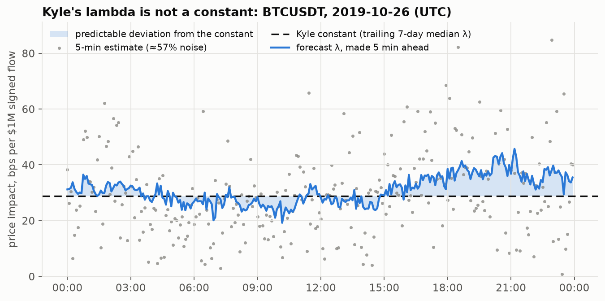
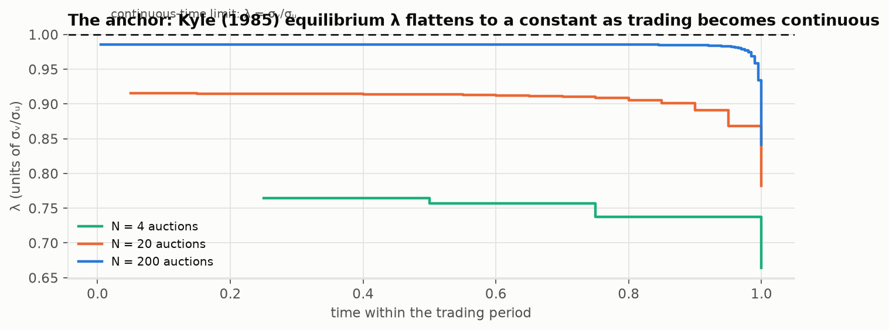
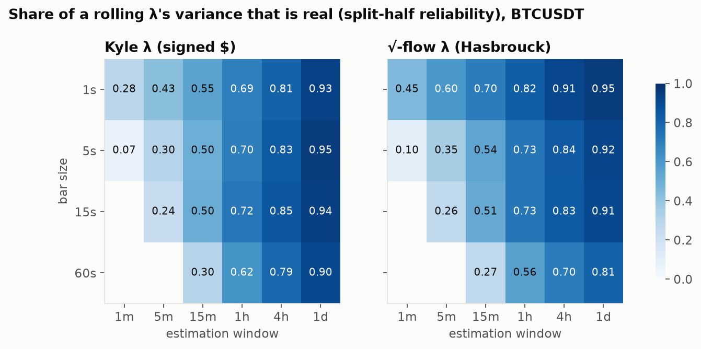
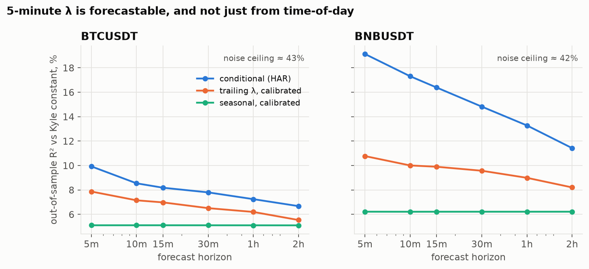
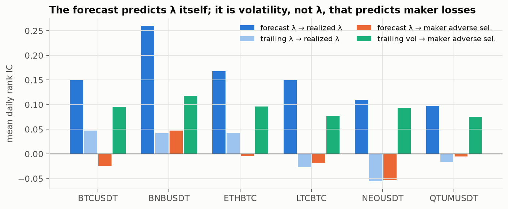
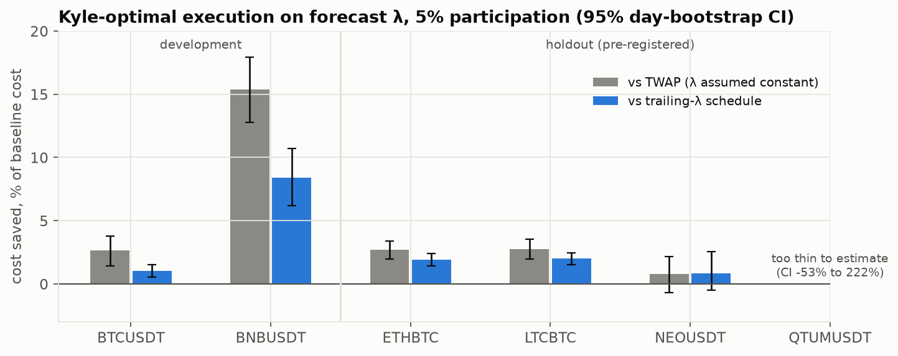

# Kyle's lambda is not a constant

*Mohamed El Khoudimi · Toronto · [github.com/mtk1606](https://github.com/mtk1606)*

**Project website:** an interactive explainer of this study lives in [`site/`](site/) (build and deploy notes in [`site/README.md`](site/README.md); every claim on it is mapped to evidence in [`site/ACCURACY_AUDIT.md`](site/ACCURACY_AUDIT.md)).



Kyle (1985) derives a market in which depth is constant through the trading period.
Its reciprocal, lambda, is the price move per unit of signed order flow, and desks
estimate it every day as a rolling regression coefficient. The model says lambda
doesn't move. The desk treats it as moving slowly. I wanted to know which of the two
is closer to the data, and whether the movement can be traded.

I tested it on 351 million raw Binance trades (six pairs, April 2018 to November 2019),
a full Nasdaq day of AMZN from LOBSTER, and about 11 hours of Coinbase L3 order-by-order
data. I developed everything on two pairs, then froze the code, wrote down predictions
(`docs/PREREGISTRATION.md`) and ran it once on four pairs I hadn't touched.

**What I found, in one paragraph.** Lambda is not constant. Within a day, the hourly
estimates disagree far more than sampling noise allows on 27 to 53% of days, and on the
AMZN day as well. The usual rolling estimate is mostly noise at the horizons people use
it: a 5-minute lambda on BTCUSDT is about 43% signal and 57% noise. The real part is
forecastable beyond intraday seasonality and beyond a tuned trailing estimate. My
original thesis was that forecast lambda predicts maker adverse selection and should
drive a quoting rule. **That part failed**, and it failed even for an oracle that knew
the next window's realized lambda. The more promising use is on the other side of the
trade. Lambda is the price of impact, and a Kyle-optimal execution schedule driven by
the forecast costs 1 to 2% less than the same schedule on trailing lambda on the liquid
pairs. It went the right way on all four holdout pairs, but it was significant on only
two, so it missed the 3-of-4 bar I set in advance.

| Pre-registered on 4 untouched pairs | Result |
|---|---|
| Constant intraday lambda rejected far more often than chance | **holds** (3/4) |
| A 5-minute rolling lambda is mostly noise | **holds** (4/4) |
| Lambda is forecastable beyond seasonality and a tuned trailing estimate | **holds** (4/4) |
| Forecast lambda predicts realized lambda better than trailing lambda | **holds** (4/4) |
| Forecast lambda predicts maker adverse selection *(original thesis)* | **fails** (0/4) |
| A quoting rule on forecast lambda beats one on trailing lambda *(original thesis)* | **fails** (0/4) |
| An execution schedule on forecast lambda beats one on trailing lambda | **fails the bar** (2/4 significant, 4/4 in the right direction) |

---

## Contents

1. [The anchor](#1-the-anchor)
2. [Data](#2-data)
3. [Phase 1: how noisy is a rolling lambda?](#3-phase-1-how-noisy-is-a-rolling-lambda)
4. [Phase 2: is lambda predictable?](#4-phase-2-is-lambda-predictable)
5. [Phase 3: is it a signal?](#5-phase-3-is-it-a-signal)
6. [Phase 4: does it make money?](#6-phase-4-does-it-make-money)
7. [Phase 5: other venues, no insiders](#7-phase-5-other-venues-no-insiders)
8. [Holdout scorecard](#8-holdout-scorecard)
9. [What I would and would not claim](#9-what-i-would-and-would-not-claim)
10. [Reproduce](#10-reproduce)

---

## 1. The anchor

Kyle's market has one risk-neutral insider, noise traders and competitive market
makers. In the sequential-auction version, the equilibrium solves a backward recursion
(Kyle 1985, Theorem 2), and as the auctions get closer together, lambda goes flat at
sigma_v / sigma_u:



`src/kylelambda/kyle.py` solves that recursion numerically, a cubic for lambda_n at each
step with a shooting search on the terminal variance. The tests check it against the
closed forms: with one auction, lambda = sigma_v / (2 sigma_u) and Sigma_1 = Sigma_0 / 2.
With 400 auctions the interior lambda is flat to within 1%, and the posterior variance
goes to zero by the close.

Two things in the model matter for everything below:

* Lambda is the market maker's price response to flow, set so that the maker breaks
  even against the insider. If makers get this right, lambda is *already* the price of
  adverse selection, not a free predictor of it. (That turns out to matter in Phase 3.)
* The constant depth depends on noise-trading volatility being constant. Once noise
  volatility moves, lambda moves with it (Collin-Dufresne and Fos, 2016, work this out
  formally). So the empirical question is how much it moves, how much of that is
  measurable, and whether any of it can be predicted.

## 2. Data

Everything is public. `data/README.md` has the download commands and the known issues.

| Set | What | Size | Used for |
|---|---|---|---|
| Binance spot, dev | BTCUSDT, BNBUSDT raw trades with buyer/seller order ids | 591 days each, 207M trades | phases 1-4, all design decisions |
| Binance spot, holdout | ETHBTC, LTCBTC, NEOUSDT, QTUMUSDT | 591 days each, 145M trades | pre-registered replication |
| LOBSTER | AMZN, Nasdaq, message file + 10-level book | 2012-06-21, 6.5 h, 11.4k executions | phase 5 |
| Coinbase L3 | BTC-USDT and ETH-USDT full channel with snapshot | 6.5 h and 4.5 h | phase 5 |

Things I had to handle rather than assume:

* **Trade sign.** Binance's `isBuyerMaker = true` means the aggressor sold. The mirror's
  README describes it loosely, so I checked: on a sample BTCUSDT day, signed flow and returns correlate
  at +0.16 to +0.27 across bar sizes, and the Phase 1 lambdas are positive on every pair.
* **Orders, not fills.** A marketable order that sweeps five resting orders prints five
  trades. I collapse them by taker order id (1.40 fills per order on BTCUSDT
  over the sample). Kyle's model is about orders, and the square-root estimator makes no sense
  at the fill level.
* **Bid-ask bounce.** There are no quotes in the Binance tape, so I build a
  bounce-corrected mid, `m = p - sign * s_hat / 2`, where s_hat is the hourly median jump
  between consecutive opposite-signed trades. Regressing raw trade-price changes on flow
  measures part of the spread as "impact." On LOBSTER and Coinbase I use the true mid.
* **Outages.** Some days have multi-hour holes. Seconds inside any gap over 300 s are
  masked, and windows that are more than 20% masked are dropped. On thin pairs this
  also masks genuine quiet periods; see the limitations.
* **File dates.** The mirror's file names are shifted a day from the UTC timestamps
  inside. I key everything off the timestamps.

## 3. Phase 1: how noisy is a rolling lambda?

**Estimators** (`src/kylelambda/estimators.py`). All four are the regression
practitioners run, `r_i = a + lambda * x_i + e_i`, within a window, with r in bps of
the mid. They differ in the flow measure x: signed dollars (Kyle), signed square-root
dollars per taker order (Hasbrouck 2009), and order-count imbalance, with Amihud's
unsigned ratio as a fourth proxy. I estimate them on a grid of bar sizes (1 s to 60 s)
and window lengths (1 min to 1 day).

**Measuring noise without trusting a standard-error formula** (`src/kylelambda/audit.py`).
Every window is estimated twice, once from its odd bars and once from its even bars.
Across windows, the correlation of the two halves is the share of variance they have in
common, which is the true lambda. Spearman-Brown converts that into the reliability of
the full-window estimate. A reliability of 0.4 means 40% of the variation you see in a
rolling lambda is real and 60% is the estimator. The tests check the method on
simulated markets with a known lambda path, and it recovers the true reliability to
within 0.06.



| BTCUSDT, 1 s bars | 1 min | 5 min | 15 min | 1 h | 4 h | 1 day |
|---|---|---|---|---|---|---|
| Kyle lambda, reliability | 0.28 | 0.43 | 0.55 | 0.69 | 0.81 | 0.93 |
| sqrt-flow lambda, reliability | 0.45 | 0.60 | 0.70 | 0.82 | 0.91 | 0.95 |
| Kyle lambda, share of windows with lambda < 0 | 20% | 5.4% | 1.3% | 0.2% | 0% | 0% |
| Kyle lambda, noise sd / median lambda | 3.3 | 1.05 | 0.61 | 0.37 | 0.25 | 0.14 |

What I take from it:

* **A 5-minute Kyle lambda on BTCUSDT is 57% noise**, and one window's estimate has a
  standard error about equal to its level. At 1 minute, one window in five has the
  wrong sign. The usable range starts at around an hour, or at 15 minutes with the
  square-root estimator.
* **Finer bars help, up to a point.** For the same window, 1 s bars beat 5 s bars
  because they give more observations. For short windows, coarser bars are much worse.
* **The square-root form is the more reliable estimator** at every horizon under an
  hour, consistent with concave impact. Order-count imbalance falls apart at 60 s bars
  (40 to 52% negative estimates): at that aggregation the count stops tracking the
  dollars.
* Regime barely changes it. For 5-minute BTCUSDT windows, reliability is 0.38 in the
  low-volatility third of days and 0.45 in the high third, and 0.42 to 0.44 across the
  Asia, Europe and US sessions. BNBUSDT looks the same (0.42 overall at 5 minutes).

**Is lambda constant within a day?** For each day I test "one lambda for all 24 hours"
with a permutation test: shuffle the hour labels of 10 s bars and see how often the
hourly slopes disperse as much as they really do. That test has the right size under
heteroskedastic noise (checked in `tests/test_estimators.py`).

| | days | reject at 1% (Kyle) | reject at 1% (sqrt) | median dispersion vs. constant-lambda null |
|---|---|---|---|---|
| BTCUSDT | 591 | 27% | 43% | 1.21x / 1.45x |
| BNBUSDT | 591 | 50% | 53% | 1.52x / 1.67x |

Under the null you would expect 1%. So the answer is no, but not in the dramatic way
the pitch suggests: on most BTCUSDT days an hourly lambda is within sampling noise of
the day's constant. The variation is real, frequent, and moderate.

## 4. Phase 2: is lambda predictable?

**Setup** (`src/kylelambda/forecast.py`). The target is the 5-minute (or 1-minute, or
1-hour) lambda estimate, divided by its trailing 7-day median, so that 1.0 means
"usual." That makes Kyle's constant the zero-skill benchmark. I compare:

* `last`: the previous window's estimate, used raw. A short rolling lambda.
* `trailing_cal`: an EWMA of past estimates with the half-life tuned in-sample, then
  linearly calibrated. The best version of desk practice I could build.
* `seasonal_cal`: the time-of-day profile over the past 28 days (weekdays and weekends
  separately), calibrated. This is the "easy and uninteresting" predictability.
* `HAR`: OLS on HAR-style lags of lambda, the seasonal term, and lagged market state
  (realized variance, volume, order count, spread, order-flow imbalance, absolute return).

Walk-forward by calendar month, a one-day embargo, and every threshold and winsorization
bound is computed on the training window only. A test (`tests/test_forecast_policy.py`)
scrambles the future and checks that no earlier forecast changes.



| 5-min windows, h = 1 | last | trailing_cal | seasonal_cal | HAR | DM t vs trailing | DM t vs seasonal | noise ceiling |
|---|---|---|---|---|---|---|---|
| BTCUSDT | -64% | 7.9% | 5.1% | **9.9%** | 19.5 | 23.6 | 43% |
| BNBUSDT | -41% | 10.8% | 6.2% | **19.1%** | 22.6 | 22.9 | 42% |

Out-of-sample R² relative to Kyle's constant. Positive means better than the constant.

* **The raw rolling estimate is worse than assuming Kyle's constant**: -64% on BTCUSDT.
  If you plug a 5-minute lambda straight into a cost model, you would be better off
  using the weekly median.
* **Seasonality is real but it is the smaller half.** The conditional model beats the
  calibrated seasonal profile by 5 points of R² on BTCUSDT and 14 on BNBUSDT, and the
  best trailing estimate by 2 and 9. Across every window length, horizon, estimator and
  pair I ran (`results/phase2_forecast.csv`), the Diebold-Mariano statistic against the
  seasonal model ranges from 3.7 to 60. Against the trailing model it is above 3 in 58
  of 60 configurations. The two exceptions are the square-root estimator on 1-minute
  BTCUSDT windows at 15 and 60 minutes ahead, where HAR and the trailing EWMA are tied.
* **Read the R² against the ceiling.** Since the target is 57% noise, the most any
  forecast could explain is about 43%. HAR gets 23% of that on BTCUSDT and 46% on
  BNBUSDT.
* Predictability decays with horizon but is still there at 2 hours (BTCUSDT 6.7%,
  BNBUSDT 11.4%). With 1-hour windows, the 1-hour-ahead R² is 11.8% and 27.0%.

## 5. Phase 3: is it a signal?

This is where I expected the result and didn't get it.

**Question.** If lambda reflects the market maker's belief about informed flow, then
forecast lambda should rank upcoming windows by how badly passive fills get picked off.

**Outcome** (`src/kylelambda/markout.py`). For every maker fill, adverse selection at
horizon tau is the aggressor-signed mid move from just before the fill to tau seconds
after, in bps, notional-weighted per window. It decomposes the maker's realized spread
as effective half-spread minus adverse selection. I score predictors by the rank IC
computed within each day (so a volatile day, with high lambda and big markouts, can't
fake it), with Newey-West t-stats across days.



| lead = 1 window, 5 min | IC vs realized lambda | IC vs maker AS (60 s) |
|---|---|---|
| BTCUSDT forecast lambda | **0.150** (t = 35) | **-0.025** (t = -5.2) |
| BTCUSDT trailing lambda | 0.047 | -0.030 |
| BTCUSDT trailing realized vol | 0.057 | **0.096** (t = 16.8) |
| BNBUSDT forecast lambda | **0.260** (t = 29) | 0.048 (t = 5.6) |
| BNBUSDT trailing lambda | 0.042 | -0.002 |
| BNBUSDT trailing realized vol | 0.121 | **0.118** (t = 21.4) |

* **The forecast predicts lambda** three to six times better than trailing lambda does,
  and it still carries information 2 hours out (IC 0.036 on BTCUSDT, 0.077 on BNBUSDT).
* **It does not reliably predict adverse selection.** The sign flips between the two
  pairs. Controlling for trailing volatility, it is significantly negative on BTCUSDT.
  Trailing realized volatility, the oldest toxicity proxy there is, beats it on both.
* **Why, I think.** Lambda is highest in thin windows, and thin windows are not where
  passive fills lose the most per dollar; the losses concentrate in busy, volatile
  windows where flow keeps coming in one direction. Forecast lambda also predicts
  *higher* maker realized spreads (IC +0.045 BTCUSDT, +0.018 BNBUSDT). Makers widen
  more than they need to when the book is thin. That is Kyle's own logic: lambda is the
  maker's price for adverse selection, so a well-set lambda should not predict losses.

## 6. Phase 4: does it make money?

### 6a. Quoting (the original thesis)

A passive provider takes 1% of all maker fills in the windows where it is quoting. It
skips the 20% of windows with the highest score, where the threshold is the trailing
7-day quantile, so every gated policy is active the same share of the time. PnL per
dollar is half-spread minus kappa times adverse selection at the hedge horizon, minus
fee. The grid covers fee (-0.5, 0, +1 bp), kappa (1, 1.5) and tau (10, 60, 300 s), with
day-clustered bootstrap CIs (`src/kylelambda/policy.py`).

| tau = 60 s, kappa = 1 | forecast gate minus trailing gate | forecast gate minus always-on | oracle (knows next lambda) minus always-on |
|---|---|---|---|
| BTCUSDT | -0.030 bps [-0.081, 0.011] | -0.090 [-0.122, -0.059] | -0.094 |
| BNBUSDT | +0.033 bps [-0.038, 0.116] | +0.039 [-0.021, 0.108] | -0.130 |

No edge. More telling: **the oracle loses too**. Knowing the next window's realized
lambda and stepping away when it is high makes a maker worse off than always quoting.
No forecast of lambda can fix a rule whose premise is wrong. The reversed rule (step
away when lambda is *low*) helps on BTCUSDT and hurts on BNBUSDT, so I don't claim it.

### 6b. Execution (where lambda is the right variable)

Lambda is literally the price of impact, so the forecast should earn its keep for
whoever *takes* liquidity. Under Kyle's linear impact, a child order of q dollars in
window w costs `HS_w + lambda_w * q / 2` bps, and for a fixed total the cheapest split
is q proportional to 1/lambda. Every schedule below uses that same rule, and they
differ only in which lambda goes in: a constant (TWAP), the trailing estimate, the
seasonal profile or the forecast. Base child size is a fixed share of typical window
volume, and each schedule's tilt is normalized so that all of them trade the same
expected volume (realized volumes come out within 4% of each other). Costs are scored
with the next window's realized lambda, whose estimation noise is independent of
anything the schedules see.

| 5% participation | forecast | trailing | TWAP | forecast minus trailing [95% CI] | saving vs trailing |
|---|---|---|---|---|---|
| BTCUSDT | 2.470 bps | 2.496 | 2.537 | **-0.026** [-0.038, -0.014] | 1.1% |
| BNBUSDT | 3.211 bps | 3.505 | 3.793 | **-0.294** [-0.375, -0.218] | 8.4% |

On both development pairs the forecast schedule is cheaper than every baseline at every
size I tried: 1%, 5% and 10% participation (`results/phase4_execution.csv`). For how
this held up out of sample, see the scorecard. On BTCUSDT the saving is small
in bps because the book was already deep; on BNBUSDT it is a real share of the cost.
Before this goes anywhere near production, it would need a nonlinear impact model and a
decay term. The saving is measured with the same linear Kyle cost the schedule
optimizes, so I'd treat these as upper bounds on the realized saving.

## 7. Phase 5: other venues, no insiders

**Holdout Binance pairs** are in the scorecard below. **Book-level venues**
(`scripts/05_book_venues.py`):

| | lambda constant within session? (30-min blocks, permutation p) | 5-min reliability (Kyle / sqrt / OFI) | persistence of true 5-min lambda |
|---|---|---|---|
| AMZN, Nasdaq, 2012-06-21 | **rejected**, p = 0.001 (dispersion 2.5x null) | 0.57 / 0.56 / **0.78** | 0.35 (Kyle), 0.59 (OFI) |
| Coinbase BTC-USDT, 6.5 h | not rejected, p = 0.76 | 0.20 / 0.30 / 0.23 | n/a |
| Coinbase ETH-USDT, 4.5 h | not rejected, p = 0.69 | below 0 (pure noise) | n/a |

"Persistence" is the lag-1 autocorrelation of the window estimates divided by their
reliability, which estimates the autocorrelation of the true lambda.

* **Nasdaq behaves like Binance.** On an equity with a real insider channel, lambda
  moves within the day and is persistent. The Cont-Kukanov-Stoikov order-flow-imbalance
  slope at the touch is the most reliable depth measure of all.
* **The Coinbase samples are a null result, not a negative one.** They are the
  USDT-quoted pairs, not BTC-USD, and they printed 1,588 and 734 trades in the whole
  sample. The L3 replay itself is clean (1M events, zero crossed books, zero unknown
  order ids), but there isn't enough flow to estimate anything. `src/kylelambda/collector/ws.py`
  records the Coinbase full channel and Bitstamp's order stream (the two public L3 feeds)
  with sequence-gap markers, so the next step is simply to run it for a few weeks. I
  have not run it for these results.

## 8. Holdout scorecard

The predictions, thresholds and commands were committed before any holdout analysis
(`docs/PREREGISTRATION.md`, commit `8f3e63b`). A prediction "holds" if it holds on at
least 3 of the 4 pairs. Full table: `results/scorecard.csv`.

| | ETHBTC | LTCBTC | NEOUSDT | QTUMUSDT | verdict |
|---|---|---|---|---|---|
| P1 days rejecting constant lambda at 1% (need at least 10%) | 30.6% | 16.9% | 7.3% | 13.0% | **holds** 3/4 |
| P2 5-min reliability (need below 0.6) | 0.45 | 0.32 | 0.21 | 0.13 | **holds** 4/4 |
| P3 DM t, HAR vs trailing / seasonal (need both above 2) | 17.7 / 26.6 | 23.4 / 25.6 | 3.0 / 5.2 | 3.3 / 4.1 | **holds** 4/4 |
| P4 IC forecast lambda vs maker AS (need above 0, t above 2) | -0.004 | -0.017 | -0.053 | -0.005 | **fails** 0/4 |
| P5 IC vs realized lambda, forecast / trailing | 0.168 / 0.043 | 0.150 / -0.027 | 0.110 / -0.055 | 0.098 / -0.016 | **holds** 4/4 |
| P6 quoting, forecast minus trailing gate, bps [95% CI] | -0.022 [-0.070, 0.023] | -0.043 [-0.083, -0.003] | -0.074 [-0.185, 0.043] | -0.99 [-8.0, 4.6] | **fails** 0/4 |
| P7 execution, forecast minus trailing, bps [95% CI] | **-0.049** [-0.061, -0.036] | **-0.062** [-0.077, -0.047] | -0.047 [-0.142, 0.028] | -8.7 [-25.5, 6.1] | **fails** 2/4 |



**Reading it.**

* Everything about lambda *as a quantity* replicated. It moves within the day, the
  rolling estimate is noisy (more so on thinner pairs: 0.13 reliability on QTUMUSDT),
  and a conditional forecast beats both seasonality and a tuned trailing estimate on
  every pair. It predicts next-window lambda with an IC of 0.10 to 0.17, where trailing
  lambda manages 0.04 at best and is negative on three pairs.
* Both of my original thesis claims failed out of sample, as I had predicted after
  seeing the development pairs. On LTCBTC the forecast-gated quoting rule is
  significantly *worse* than the trailing one.
* The execution claim is the honest middle. On ETHBTC and LTCBTC the saving (about 2% of
  cost) is as clean as on the development pairs. NEOUSDT points the same way with a CI
  that crosses zero. QTUMUSDT is too thin to measure: its median 5-minute window trades
  about $2,500, the realized-lambda cost it is scored on is extremely heavy-tailed, and
  about 21% of its windows are masked. By my own rule this fails, and I'm leaving it
  as a fail. My read is that the effect is real on pairs liquid enough to measure it,
  but "on pairs liquid enough" is a condition I added after the fact, so it is a
  hypothesis for the next dataset, not a result.

**One deviation, disclosed.** The first holdout run had a units bug. For BTC-quoted pairs
converted to USD, the effective half-spread mixed USD and BTC (`sn - mid * sv`), which
inflated ETHBTC's half-spread to about 490 bps. It hit P6 and P7 on ETHBTC and LTCBTC
only. The fix is a conversion factor, with a regression test, and changes no threshold
or parameter. As first run, P7 scored 1/4 and P6 0/4. After the fix, P7 is 2/4 and P6
0/4, so the verdicts are the same either way. The as-run scorecard is kept at
`results/scorecard_as_run.csv`.

## 9. What I would and would not claim

I would say:

* The rolling lambda that desks quote is mostly noise below 15 minutes. I measured how
  much at every bar and window size, without assuming a standard-error formula.
* Lambda varies within the day far more than a constant allows, on crypto and on a
  Nasdaq stock. The real variation is forecastable beyond time-of-day and beyond a tuned
  trailing estimate.
* That forecast lowers execution cost by 1 to 2% on liquid pairs (4 of 6 pairs
  significant, including 2 held out), when it drives an otherwise identical
  impact-aware schedule. It did not clear the replication bar I set in advance, so I
  describe it as promising, not established.

I would not say:

* That forecast lambda predicts adverse selection or makes a better quoting rule. I
  believed that going in, pre-registered it, and it failed. An oracle version failed
  too, which says the idea itself is wrong, not just my forecast.
* Anything about crypto L3 at scale. Two thin USDT-pair samples are not an audit.
* That the execution saving is realizable as measured. It uses a linear impact model
  and my own lambda estimates as the cost; a live test would use fills.

**Limitations I know about.** 2018 and 2019 are one market, one exchange, and mostly a
bear market followed by a rally. The bounce-corrected mid is a proxy. The outage mask
treats any 5-minute gap in trades as missing data, which removes real quiet periods on
the thinnest pairs (QTUMUSDT and NEOUSDT have many). The quoting simulation assumes my
fills look like the average maker's, and kappa only partly corrects for queue position.

## 10. Reproduce

```bash
pip install -e ".[dev]"
pytest                                   # 21 tests: Kyle closed forms, estimator recovery,
                                         # permutation-test size and power, no look-ahead
# data: see data/README.md
python scripts/00_build_bars.py --mirror /data/ticks --symbols BTCUSDT BNBUSDT ETHBTC LTCBTC NEOUSDT QTUMUSDT
python scripts/00b_quote_to_usd.py --symbols ETHBTC LTCBTC
python scripts/01_audit.py      --symbols BTCUSDT BNBUSDT
python scripts/02b_markouts.py  --symbols BTCUSDT BNBUSDT
python scripts/02_dynamics.py   --symbols BTCUSDT BNBUSDT
python scripts/03_signal.py     --symbols BTCUSDT BNBUSDT
python scripts/04_economic.py   --symbols BTCUSDT BNBUSDT
python scripts/05_book_venues.py --raw /data/raw
# holdout: the exact commands are in docs/PREREGISTRATION.md
python scripts/06_scorecard.py
python scripts/make_figures.py
```

On 4 cores, the bar build takes about 10 minutes for all six pairs and the analysis about an hour.

```
src/kylelambda/
  kyle.py          Kyle (1985) N-auction equilibrium solver + synthetic markets
  data/            Binance tape loader (reads straight from a partial git clone), LOBSTER, Coinbase L3 replay
  bars.py          1 s bars, bounce-corrected mid, taker-order aggregation
  estimators.py    window lambda: Kyle, sqrt (Hasbrouck), count, OFI (Cont-Kukanov-Stoikov), Amihud
  audit.py         split-half reliability, permutation test of constancy
  forecast.py      seasonal, trailing, HAR; walk-forward with embargo
  markout.py       maker half-spread / adverse selection from bar aggregates
  signal.py        daily rank IC, Newey-West, incremental regressions
  policy.py        quoting gate and Kyle-optimal execution schedules, day-clustered bootstrap
  collector/ws.py  websocket recorder (Coinbase full, Bitstamp orders, Binance/Bybit L2)
results/           every number quoted above, as CSV; figures/
docs/PREREGISTRATION.md
```

### References

Kyle, A. S. (1985). Continuous auctions and insider trading. *Econometrica* 53(6).
Hasbrouck, J. (2009). Trading costs and returns for U.S. equities: estimating effective costs from daily data. *Journal of Finance* 64(3).
Amihud, Y. (2002). Illiquidity and stock returns. *Journal of Financial Markets* 5(1).
Cont, R., Kukanov, A., and Stoikov, S. (2014). The price impact of order book events. *Journal of Financial Econometrics* 12(1).
Collin-Dufresne, P., and Fos, V. (2016). Insider trading, stochastic liquidity, and equilibrium prices. *Econometrica* 84(4).
Easley, D., López de Prado, M., and O'Hara, M. (2012). Flow toxicity and liquidity in a high-frequency world. *Review of Financial Studies* 25(5).
